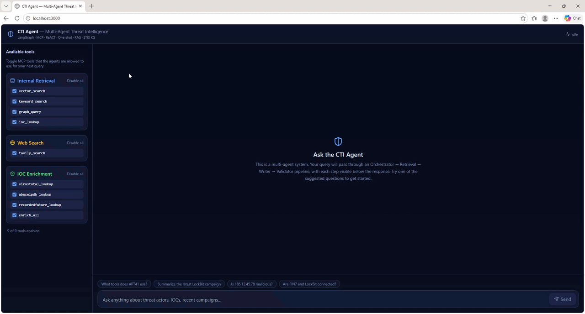
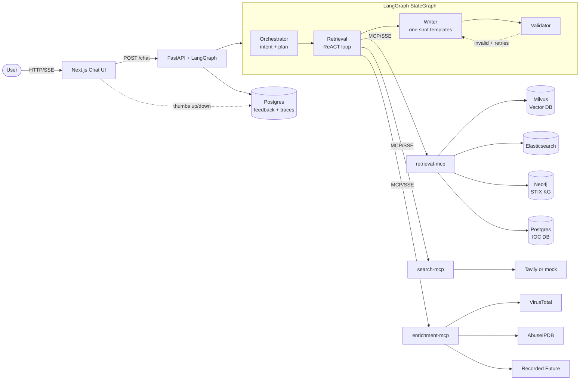

# CTI Agent

A multi agent platform that automates the routine half of a Cyber Threat Intelligence analyst's day. It triages new reports, profiles threat actors, enriches IOCs against external feeds, and correlates evidence across multiple data stores. Users chat with it the way they would a junior analyst, and every step the agents take is visible in a collapsible timeline below the answer.

This repository is a public, synthetic data version of a production Agentic AI stack I built and run at work. The agent architecture, prompting patterns, MCP server design, and validation loop here are the same as production. The actual data sources, paid feeds, and customer specific connectors have been replaced with RSS feeds, MITRE ATT&CK, and deterministic mocks so the project can ship as a portfolio piece without leaking anything sensitive.

## CTI Agent Demo
<p align="center">
  
</p>

## What an analyst's flow looks like in the system

Ask "What tools does APT41 use?" and the request walks through four agents.

The Orchestrator agent reads the question, decides the intent is a threat actor profile, and picks the tools it wants the next agent to call (`graph_query`, `vector_search`, `keyword_search`). The Retrieval agent runs a ReACT loop where it calls those tools one at a time, reads each result, and decides whether to call another. The Writer agent picks one of five curated prompt templates based on the orchestrator's plan and drafts a Markdown answer. The Validator agent checks the answer is grounded in the evidence; if it is not, the graph loops back to the Writer with feedback for one or two more tries.

Every tool call, every plan, every retry shows up in the UI underneath the chat bubble. After the answer renders, the user can click thumbs up or thumbs down, which writes a row to a Postgres feedback table keyed by run id. That table is the seed dataset for offline RLHF or DPO style training.

## Architecture



The four agents communicate through a shared LangGraph state. Each node reads what the previous nodes wrote, contributes its own delta, and the orchestration framework merges everything together. The conditional edge from Validator back to Writer is the heart of the self correction loop; it only fires when validation fails and we have retries left.

The retrieval MCP server is the one that talks to all four knowledge stores. The search MCP server wraps Tavily for open web search. The enrichment MCP server exposes one tool per third party reputation service. Splitting them this way means a new tool category can be added by writing one new MCP server, without touching the others.

## What the agents look like in code

The Orchestrator runs first. Its job is to read the user's question and output a JSON plan that the rest of the graph follows.

```python
# agents/orchestrator.py (abridged)

_VALID_TEMPLATES = {
    "summary", "threat_actor_profile", "ioc_report",
    "correlation", "general",
}

async def orchestrator_node(state):
    prompt = load_prompt("orchestrator").format(
        user_query=state["user_query"],
        available_tools=", ".join(state["available_tools"]),
        selected_tools=", ".join(state["selected_tools"]) or "ALL",
    )
    llm = get_llm(temperature=0.0)
    resp = await llm.ainvoke([
        SystemMessage(content=prompt),
        HumanMessage(content=state["user_query"]),
    ])
    plan = _parse_json(resp.content)

    # Safety net: fall back to general if the model hallucinates a name.
    if plan.get("writer_template") not in _VALID_TEMPLATES:
        plan["writer_template"] = "general"

    # User's tool selection from the UI sidebar always wins.
    if state["selected_tools"]:
        plan["tools_to_use"] = [
            t for t in plan.get("tools_to_use", [])
            if t in state["selected_tools"]
        ]

    return {"plan": plan, "trace": trace}
```

The Retrieval agent gets the plan and runs a ReACT loop against the MCP toolset. It uses `langgraph.prebuilt.create_react_agent`, which handles the Thought / Action / Observation cycle through the OpenAI function calling interface. The system prompt is heavily directive about always invoking at least one tool, since local LLMs sometimes try to answer from general knowledge.

```python
# agents/retrieval.py (abridged)

async def retrieval_node(state):
    all_tools = await load_all_tools()                # MCP discovery
    tools = filter_tools(all_tools, state["plan"]["tools_to_use"])

    system_prompt = load_prompt("retrieval_react").format(
        user_query=state["user_query"],
        plan=json.dumps(state["plan"]),
    )
    react_agent = create_react_agent(get_llm(0.0), tools, prompt=system_prompt)

    result = await react_agent.ainvoke(
        {"messages": [HumanMessage(content=state["user_query"])]},
        config={"recursion_limit": 12},
    )
    evidence = _evidence_from_messages(result["messages"])
    return {"evidence": evidence, "trace": trace}
```

The Writer takes the orchestrator's plan, looks up which template to use, and renders the answer.

```python
# agents/writer.py (abridged)

_TEMPLATE_MAP = {
    "summary":              "writer_summary",
    "threat_actor_profile": "writer_threat_actor",
    "ioc_report":           "writer_ioc_report",
    "correlation":          "writer_correlation",
    "general":              "writer_general",
}

async def writer_node(state):
    template_name = _TEMPLATE_MAP.get(
        state["plan"].get("writer_template", "general"),
        "writer_general",
    )
    prompt = load_prompt(template_name).format(
        user_query=state["user_query"],
        evidence=_format_evidence(state.get("evidence")),
    )
    if feedback := state.get("validation", {}).get("feedback"):
        prompt += f"\n\nThe previous attempt failed validation. Fix this: {feedback}"

    resp = await get_llm(0.3).ainvoke([
        SystemMessage(content=prompt),
        HumanMessage(content=state["user_query"]),
    ])
    return {"answer": resp.content, "trace": trace}
```

The Validator returns a small JSON verdict that the graph uses to decide whether to retry.

```python
# agents/validator.py (abridged)

async def validator_node(state):
    prompt = load_prompt("validator").format(
        user_query=state["user_query"],
        evidence=_format_evidence(state.get("evidence")),
        answer=state.get("answer", ""),
    )
    resp = await get_llm(0.0).ainvoke([SystemMessage(content=prompt), HumanMessage(content=state["user_query"])])
    verdict = _parse_json(resp.content)  # {"valid": bool, "issues": [...], "feedback": "..."}
    return {
        "validation": verdict,
        "retry_count": state.get("retry_count", 0) + (0 if verdict["valid"] else 1),
        "trace": trace,
    }
```

And the graph that wires them together. The conditional edge from Validator is the only branching point.

```python
# agents/graph.py (abridged)

def build_graph():
    g = StateGraph(CTIState)
    g.add_node("orchestrator", orchestrator_node)
    g.add_node("retrieval",    retrieval_node)
    g.add_node("writer",       writer_node)
    g.add_node("validator",    validator_node)

    g.add_edge(START,           "orchestrator")
    g.add_edge("orchestrator",  "retrieval")
    g.add_edge("retrieval",     "writer")
    g.add_edge("writer",        "validator")
    g.add_conditional_edges("validator", _route_after_validator, {
        "writer": "writer", END: END,
    })
    return g.compile()
```

## How the orchestrator picks the right writer template

This trips people up the first time they read the code, so it's worth spelling out. The five prompt templates in `agents/prompts/writer_*.txt` each have a different output shape. A summary template just gives a tight summary of one report. A threat actor profile uses MITRE style sections (Aliases, Origin, TTPs, Tooling, Recent activity). An IOC report has a verdict line and a comparison table. The choice of template controls the whole shape of the final answer.

The orchestrator is the one that decides which to use. Its prompt lists the five valid template names and shows a worked one shot example, so the model classifies the user's intent into one of those five buckets and returns it as the `writer_template` field of its JSON plan. The orchestrator code then validates that value against a whitelist (`_VALID_TEMPLATES`) and falls back to `general` if the model returned something we do not recognise. The Writer reads `state["plan"]["writer_template"]`, looks the string up in `_TEMPLATE_MAP`, and loads the corresponding `.txt` file from `agents/prompts/`.

To add a sixth template, say `vulnerability_brief`, you create `agents/prompts/writer_vulnerability_brief.txt` with a one shot example, add `"vulnerability_brief": "writer_vulnerability_brief"` to `_TEMPLATE_MAP` in `writer.py`, add `vulnerability_brief` to `_VALID_TEMPLATES` in `orchestrator.py`, and append the new value to the pipe separated list in `agents/prompts/orchestrator.txt`. Rebuild the api container and the new template is live.

## How the MCP server design lets you bolt on new tools

The cleanest demonstration of the modularity is in the enrichment server. To add a new reputation provider (say GreyNoise), you add one class to `mcp_servers/enrichment_mcp/adapters.py`:

```python
class GreyNoiseAdapter(EnrichmentAdapter):
    name = "greynoise"

    def __init__(self):
        self.api_key = os.getenv("GREYNOISE_API_KEY", "")

    def available(self):
        return bool(self.api_key)

    def enrich(self, value, ioc_type):
        if not self.available():
            return _mock_response("greynoise", value, ioc_type, classification="benign")
        with httpx.Client() as c:
            r = c.get(f"https://api.greynoise.io/v3/community/{value}",
                      headers={"key": self.api_key})
            return r.json()

ADAPTERS.append(GreyNoiseAdapter())
```

The enrichment MCP server already iterates over `ADAPTERS` to register one tool per provider, so a tool called `greynoise_lookup` is automatically exposed. No changes to the agent code, no MCP server restart logic to write. The retrieval agent rediscovers tools on every run, so it picks up the new one immediately.

The retrieval MCP server uses the same pattern. To add a new retrieval source, drop a function decorated with `@registry.register()` into `mcp_servers/retrieval_mcp/server.py`:

```python
@registry.register()
def shodan_lookup(ip: str, top_k: int = 10) -> list:
    """Look up an IP in Shodan and return ports, services, banners."""
    return shodan_client.host(ip)
```

That's it. The tool appears in the orchestrator's `available_tools` list on the next request, and the UI sidebar grows a new checkbox for it.

## Knowledge stores

Four stores power the retrieval side.

Milvus holds sentence transformer embeddings of chunked CTI report text plus metadata (source, URL, threat actors, malware mentioned, published date). The `vector_search` tool runs an HNSW search there. Chunking is done with a token aware sentence splitter that preserves paragraph boundaries and adds overlap between chunks.

Elasticsearch holds the same documents in their full form, BM25 indexed. The `keyword_search` tool hits this when the agent needs exact match retrieval, like a CVE id, hash, or specific tool name. Semantic similarity is bad at exact tokens; BM25 is good at them.

Neo4j holds a STIX 2.1 knowledge graph populated from the MITRE ATT&CK enterprise bundle. Threat actors, malware, tools, attack patterns, vulnerabilities, and the relationships between them. The `graph_query` tool answers structural questions like "what tools does APT41 use" with a Cypher query.

Postgres holds the IOC database (IP, domain, hash, URL, CVE rows with confidence, tags, first seen, last seen) and two more tables: `agent_runs` records every full run with its trace, and `feedback` records every thumbs up or thumbs down keyed to the corresponding run id. The `ioc_lookup` tool reads from `iocs`. The API writes to `agent_runs` and `feedback`.

## Prompt techniques used

Two techniques, in different places.

**ReACT** drives the Retrieval agent. The model alternates between reasoning, calling a tool, and observing the result. We use the OpenAI function calling flavour of ReACT, not the text parsing flavour, because Qwen3 follows the function calling spec more reliably and we get tool call observability for free from the LangChain message log. The system prompt in `agents/prompts/retrieval_react.txt` is explicit about using the function call mechanism and mandates at least one tool call before responding.

**One shot prompting** is used everywhere structure matters. The orchestrator prompt has a worked example showing the exact JSON shape we want. Each of the five Writer templates has a worked input output pair showing the section structure of that template. The Validator has a worked example showing the JSON verdict shape. The point of one shot here is not to teach the model the domain (it knows the domain) but to pin the output structure so downstream code can parse it deterministically. With a local LLM and no fine tuning, this matters a lot more than it does with GPT-4.

## Tech stack

Backend is Python 3.11, FastAPI with `sse-starlette` for streaming, Pydantic v2 for validation, LangChain 0.3 and LangGraph 0.2 for the agent layer. The MCP servers run on the `mcp` Python SDK with FastMCP and SSE transport. The agent's bridge to MCP is a 70 line direct adapter (`agents/tools/mcp_loader.py`) that builds LangChain `StructuredTool` instances from MCP tool descriptors, with a Pydantic args schema built dynamically from the MCP JSON Schema. We deliberately do not depend on `langchain-mcp-adapters` because its langchain-core lower bound drifts and breaks the install every few weeks.

The LLM is local. The default is Qwen3 served by vLLM over its OpenAI compatible API. Any vLLM, Ollama, or TGI endpoint that speaks the same protocol works. The wrapper in `agents/llm.py` strips a few request body fields that strict vLLM builds reject (more on this below).

Embeddings come from `sentence-transformers/multi-qa-mpnet-base-dot-v1`. Databases are Milvus 2.4, Elasticsearch 8, Neo4j 5 with the APOC plugin, and Postgres 16. Frontend is Next.js 14 with the App Router, React 18, Tailwind CSS, and lucide-react. Everything ships in a single docker-compose file with no external service dependencies.

## Repository layout

```
cti-agent/
  docker-compose.yml          one shot stack: 4 DBs + 3 MCPs + API + UI
  .env.example                all configuration
  agents/                     LangGraph multi agent system
    orchestrator.py
    retrieval.py              ReACT loop
    writer.py                 one shot templates
    validator.py
    graph.py                  StateGraph wiring + conditional retry edge
    prompts/                  8 prompt templates
    tools/mcp_loader.py       direct MCP to LangChain bridge (70 lines)
    llm.py                    vLLM tolerant ChatOpenAI factory
    state.py
    config.py
  ingestion/                  RAG pipeline
    rss_ingestor.py           The Hacker News, Bleeping, Krebs
    chunker.py                token aware sentence chunking + overlap
    extractors.py             regex IOC + actor/malware dictionaries
    embedder.py
    writers.py                Milvus + Elasticsearch
    pipeline.py               end to end runner
  databases/
    milvus/client.py
    elasticsearch/client.py
    neo4j/
      stix_loader.py          MITRE ATT&CK to Neo4j
      queries.py              Cypher helpers
      schema.cypher
    postgres/
      init.sql                iocs + agent_runs + feedback schemas
      client.py
  mcp_servers/                one server per tool category
    retrieval_mcp/            vector_search, keyword_search, graph_query, ioc_lookup
    search_mcp/               tavily_search (hybrid live/mock)
    enrichment_mcp/           VT, AbuseIPDB, Recorded Future (hybrid)
  api/main.py                 FastAPI + SSE streaming
  frontend/                   Next.js chatbot
    app/page.tsx
    components/
    lib/api.ts                SSE client
  scripts/
    generate_synthetic_reports.py
```

## Quick start

Prereqs are Docker Desktop and an OpenAI compatible LLM endpoint reachable from your Docker network. vLLM on the host machine is the assumed default.

Copy the example env file and point it at your LLM.

```bash
cp .env.example .env
# edit LLM_BASE_URL and LLM_MODEL
# optional: set TAVILY_API_KEY, VIRUSTOTAL_API_KEY, ABUSEIPDB_API_KEY for live mode
```

Bring up the stack.

```bash
docker compose up -d
```

That starts Milvus, Elasticsearch, Neo4j, Postgres, the three MCP servers, the FastAPI backend, and the Next.js UI. The UI is at `http://localhost:3000`.

Seed the knowledge stores. The first command embeds RSS articles into Milvus and Elasticsearch (falls back to synthetic CTI reports if RSS is unreachable). The second command pulls MITRE ATT&CK and loads it into Neo4j.

```bash
docker compose exec api python -m ingestion.pipeline
docker compose exec api python -m databases.neo4j.stix_loader
```

A few queries to try once everything is running:

```
What tools does APT41 use?
Summarize the latest LockBit campaign
Is 185.12.45.78 malicious?
Are FIN7 and LockBit connected?
Give me an IOC report on CVE-2024-3400
```

## Production lessons

Most of the time spent on this project went into getting a local LLM stack to behave reliably. The standard tutorials assume you are using OpenAI, where most of these issues do not exist. Worth listing because the debugging is representative of real Agentic AI engineering work.

vLLM rejected every chat call with HTTP 400 until I figured out that `langchain-openai` attaches `stream_options={"include_usage": True}` to non streaming requests, and stricter vLLM builds refuse to accept it. The fix in `agents/llm.py` is an httpx request hook that strips that field (plus `parallel_tool_calls` and redundant `n=1`) from every outgoing body before it goes on the wire. Works across every patch version of langchain-openai because the strip happens at the HTTP layer.

vLLM also refused requests with no user turn, returning "No user query found in messages." The standard LangChain pattern of putting everything into a single `SystemMessage` does not work. Every agent node now sends `[SystemMessage(prompt), HumanMessage(user_query)]` to satisfy the Qwen3 chat template.

`langchain-mcp-adapters` was a constant source of dependency churn. The library's lower bound on `langchain-core` moved upward every few releases, and pinning either side broke installs. The fix was to remove the dependency entirely and write the bridge ourselves in 70 lines using only the `mcp` SDK and `pydantic.create_model`. This also fixed a bug in the 0.0.x line where `get_tools()` silently returned an empty list outside an `async with` block.

FastMCP crashes during tool registration when it sees subscripted type annotations like `Optional[str]` or anything left as a string by `from __future__ import annotations`. The fix is to remove `from __future__ import annotations` from MCP server files and stick to bare class annotations in tool signatures.

Milvus 2.4's expression parser rejects `LIKE` filters with leading wildcards (`failed to create query plan`). I pulled the threat actor filter out of Milvus and do it as a soft post filter in Python instead. The embedding ranking already pulls the relevant chunks to the top, so the post filter is more of a tiebreaker than a hard constraint.

The retrieval agent initially skipped all tool calls and answered from general knowledge. The cause was a prompt that mixed text format ReACT instructions (Thought / Action / Observation) with the OpenAI function calling interface. Qwen3 looked at the conflicting instructions and just generated a text response. Rewriting the prompt to drop the text format and explicitly mandate function calls fixed it.

The `httpx` body stripper alone has paid for itself across three different vLLM versions. None of these issues are findable through search; you find them by reading the actual request bodies, response bodies, and stack traces and working backward.

## Roadmap

Caching is the biggest gap. External enrichment API calls (VirusTotal, AbuseIPDB) are slow and rate limited; the same IOC gets looked up dozens of times across runs. A small Redis or Postgres backed cache in front of the enrichment MCP server would cut latency from around one second per call to single digit milliseconds on hot indicators, and keep the API quotas from getting hammered. Same idea but with shorter TTLs for `vector_search` results within a session.

Background ingestion. Right now seeding is manual. A cron container, or an Airflow DAG, or a Kubernetes CronJob in a production deployment would pull RSS feeds hourly and STIX/TAXII feeds daily. The ingestion pipeline is idempotent on RSS items thanks to URL based hashing, so re-running it is safe.

Tracing. The LangSmith env var is already wired into `.env`. Turning it on and standing up an observability dashboard is mostly configuration.

Authentication. Currently single tenant. SSO and per user RBAC controlling which tools each analyst can use would be a real production requirement.

DPO training. The `agent_runs` and `feedback` tables already form a DPO ready pair dataset (winning answer = thumbs up, losing answer = thumbs down on the same query). A scheduled fine tuning job emitting a new Qwen adapter weekly is the obvious next move once we have enough labelled traffic.

Threat actor entity disambiguation. The dictionary in `extractors.py` treats "APT41" and "Wicked Panda" as separate strings. They should resolve to the same Neo4j node via the `aliases` field on the STIX intrusion set. The KG already has the data; the extractor needs to consult it.

## Scope notes

The CTI reports are public RSS feeds plus a small synthetic seed set. Production ingests from paid threat intel feeds, internal sensors, and customer specific sources that cannot be shared. The IOC database here has about ten demo indicators; production has tens of thousands continually backfilled. The STIX knowledge graph is MITRE ATT&CK only; production also has custom intrusion set and campaign nodes maintained by analysts. External enrichment defaults to mock mode; set the relevant API key env vars to hit real providers. The frontend is intentionally minimal, enough to demonstrate every agentic capability cleanly but not a polished SOC console.

The agent architecture, MCP server design, prompt techniques, validation loop, and human in the loop feedback storage match production exactly. Only the data is different.

## Acknowledgements

MITRE ATT&CK STIX bundle (CC BY 4.0). `iocextract` for IOC regex patterns. The MCP working group for the protocol spec. The system replaces an earlier non agentic CTI bot we built in house, which is what motivated the move to a proper Agentic architecture.
