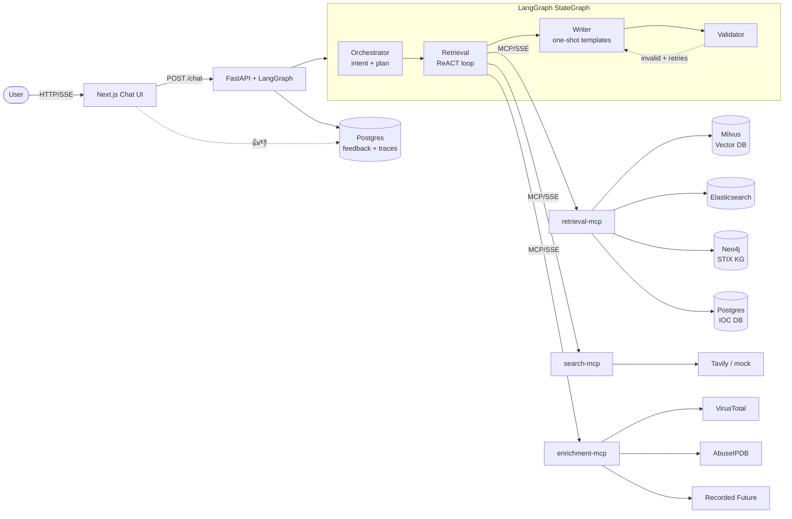

# CTI Agent — A Multi-Agent Threat Intelligence Platform

> A from-scratch, end-to-end **Agentic AI** system that automates a Cyber Threat Intelligence (CTI) analyst's daily workflow: report triage, threat-actor profiling, IOC enrichment, and cross-source correlation.
>
> This is a **public, synthetic-data version** of a production-grade Agentic stack I built and operate at work. The architecture, prompting patterns, MCP server design, and validation loop mirror the real system; only the data sources, customer-specific connectors, and proprietary enrichments have been replaced with public or mocked equivalents so the project can ship as a portfolio piece.

---

## Why this project

CTI analysts spend hours every day on the same handful of tasks:

- Reading new threat reports as they land and pulling out the relevant tools / TTPs / IOCs
- Correlating across reports to answer questions like *"What tools does APT41 use, and have they been observed in the last 90 days?"*
- Enriching IOCs against VirusTotal / AbuseIPDB / Recorded Future before triage
- Writing the final write-up in a consistent format

This system collapses that work into a chat interface backed by **four specialised agents** wired together with LangGraph, each tool-equipped through **MCP (Model Context Protocol) servers**. The user sees every step the agents take, can constrain which tools they're allowed to use, and gives a 👍 / 👎 on the answer to grow a feedback dataset for offline RLHF / DPO.

---

## Demo

```
User: "What tools does APT41 use?"

  → Orchestrator        decides intent=threat_actor_profile,
                        routes to [graph_query, vector_search, keyword_search]
  → Retrieval (ReACT)   calls graph_query("APT41", "uses")    → tools list
                        calls vector_search("APT41 tools")    → 3 chunks
                        calls keyword_search("APT41")          → 2 hits
  → Writer              renders one-shot "threat_actor_profile" template
                        with the gathered evidence
  → Validator           checks answer is grounded in evidence  → valid
  → User                receives Markdown profile, can 👍 / 👎
```

Every one of those steps is visible in a collapsible timeline beneath the chat bubble.

---

## Architecture



### The four agents

| Agent | Responsibility | Prompting | LLM control |
|---|---|---|---|
| **Orchestrator** | Classify intent, pick the writer template, decide which MCP tools the retrieval agent may use | One-shot JSON | `temperature=0`, strict schema |
| **Retrieval** | Loop tool-calls over the MCP fleet to gather evidence | ReACT (function-calling) | `temperature=0`, max 5 tool calls |
| **Writer** | Render the final answer from one of five curated one-shot templates | One-shot Markdown | `temperature=0.3` |
| **Validator** | Decide if the answer is grounded in the evidence; if not, send Writer back to retry with feedback | One-shot JSON | `temperature=0`, ≤2 retries |

### Knowledge stores

| Store | What it holds | Powers |
|---|---|---|
| **Milvus** | Sentence-transformer embeddings of chunked CTI reports + metadata | `vector_search` |
| **Elasticsearch** | Full report text, BM25-indexed | `keyword_search` (CVE IDs, hashes) |
| **Neo4j** | MITRE ATT&CK STIX bundle + ingested intel as a property graph | `graph_query` ("what tools does APT41 use?") |
| **Postgres** | IOCs (IP, domain, hash, URL, CVE), agent run traces, feedback | `ioc_lookup`, history, RLHF dataset |

---

## Capabilities mapped to "Agentic AI" requirements

This is a quick reference of what's implemented and where it lives — useful for code-walkthroughs in interviews.

### Multi-agent orchestration (LangGraph)
`agents/graph.py` wires the four nodes into a `StateGraph` with a conditional edge from `validator` back to `writer` on failure. Each node returns a delta dict that's merged into shared state; `graph.astream(stream_mode="updates")` provides per-node events for the streaming UI.

### Modular MCP tools
`mcp_servers/{retrieval,search,enrichment}_mcp/server.py` — three FastMCP servers, **one per tool category**. Each uses a `ToolRegistry` so **adding a new tool is one decorator**:

```python
@registry.register()
def my_new_tool(arg1: str, arg2: int = 10) -> dict:
    """Tool description shown to the agent."""
    ...
```

For the enrichment server it's even cleaner — add a new `EnrichmentAdapter` subclass and the tool function is auto-generated:

```python
class GreyNoiseAdapter(EnrichmentAdapter):
    name = "greynoise"
    def available(self): return bool(os.getenv("GREYNOISE_API_KEY"))
    def enrich(self, value, ioc_type): ...

ADAPTERS.append(GreyNoiseAdapter())   # done -- tool auto-registers
```

The agent rediscovers tools on every run, so no restart is needed.

### Prompt techniques

| Technique | Where | Why |
|---|---|---|
| **ReACT** (function-calling) | `prompts/retrieval_react.txt` | Drives the Retrieval agent's tool-use loop |
| **One-shot** | All Writer / Orchestrator / Validator templates | Pins the output structure (JSON shape or Markdown sections) for a local LLM |

Five curated Writer templates — `summary`, `threat_actor_profile`, `ioc_report`, `correlation`, `general` — each with a worked input/output example. The Orchestrator picks one per query.

### Validation loop
The Validator returns `{valid, issues, feedback}`. On `valid=false`, the LangGraph conditional edge routes back to the Writer, **passing the validator's feedback into the prompt** so the second attempt is targeted, not random.

### Human-in-the-loop feedback
- Each completed run gets a `run_id`.
- 👍 / 👎 buttons in the UI `POST /feedback` with the run id and rating.
- Storage schema in `databases/postgres/init.sql`:

```sql
agent_runs (id, user_query, selected_tools, final_answer, steps JSONB, ...)
feedback   (id, run_id, rating IN (-1, 1), comment, user_email, created_at)
```

The `steps JSONB` column stores the full agent trace, so the feedback dataset has not just the final answer but every reasoning step — usable directly for offline DPO / RLHF training.

### Tool selection by the user
The UI has a sidebar showing every discovered MCP tool, grouped by category, each with a checkbox. The user's selection is sent with the query and **intersected with the orchestrator's plan** in `agents/orchestrator.py` — so the user always wins. This lets analysts run queries in "internal-only" mode (no Tavily, no VT) for sensitive cases.

### Step-level transparency
Each agent records `TraceEvent`s into shared state. The API streams them over Server-Sent Events; the UI renders a collapsible timeline below each answer:

```
✓ Orchestrator   intent=threat_actor_profile, rationale="..."
✓ Retrieval      action: graph_query → 5 records
                 action: vector_search → 3 chunks
✓ Writer         template=threat_actor_profile, 1.8s, preview "..."
✓ Validator      ✓ Validated
```

---

## Tech stack

**Backend:** Python 3.11, FastAPI, sse-starlette, Pydantic v2, LangChain ≥0.3.18, LangGraph ≥0.2.50
**MCP:** `mcp` Python SDK (FastMCP, SSE transport) — *no `langchain-mcp-adapters`*, replaced with a 70-line direct bridge for cross-version stability (see [Production lessons](#production-lessons))
**LLM:** vLLM serving Qwen3 over an OpenAI-compatible endpoint (any compatible local server works — vLLM, Ollama, TGI)
**Embeddings:** `sentence-transformers/multi-qa-mpnet-base-dot-v1`
**Databases:** Milvus 2.4, Elasticsearch 8, Neo4j 5 (+APOC), Postgres 16
**Frontend:** Next.js 14 (App Router), React 18, Tailwind CSS, lucide-react
**Infra:** Docker Compose (single-command stack), no external dependencies required

---

## Repository layout

```
cti-agent/
├── docker-compose.yml          # one-shot stack: 4 DBs + 3 MCPs + API + UI
├── .env.example                # all configuration
├── agents/                     # LangGraph multi-agent system
│   ├── orchestrator.py
│   ├── retrieval.py            # ReACT loop
│   ├── writer.py               # one-shot templates
│   ├── validator.py
│   ├── graph.py                # StateGraph wiring + conditional retry edge
│   ├── prompts/                # 8 prompt templates
│   ├── tools/mcp_loader.py     # direct MCP→LangChain bridge (70 lines)
│   ├── llm.py                  # vLLM-tolerant ChatOpenAI factory
│   ├── state.py
│   └── config.py
├── ingestion/                  # RAG pipeline
│   ├── rss_ingestor.py         # The Hacker News, Bleeping, Krebs, ...
│   ├── chunker.py              # token-aware sentence chunking + overlap
│   ├── extractors.py           # regex IOC + actor/malware dictionaries
│   ├── embedder.py
│   ├── writers.py              # Milvus + Elasticsearch
│   └── pipeline.py             # end-to-end runner
├── databases/
│   ├── milvus/client.py
│   ├── elasticsearch/client.py
│   ├── neo4j/
│   │   ├── stix_loader.py      # MITRE ATT&CK → Neo4j
│   │   ├── queries.py          # Cypher helpers
│   │   └── schema.cypher
│   └── postgres/
│       ├── init.sql            # iocs + agent_runs + feedback schemas
│       └── client.py
├── mcp_servers/                # one server per tool category
│   ├── retrieval_mcp/          # vector_search, keyword_search, graph_query, ioc_lookup
│   ├── search_mcp/             # tavily_search (hybrid live/mock)
│   └── enrichment_mcp/         # VT, AbuseIPDB, Recorded Future (hybrid)
├── api/main.py                 # FastAPI + SSE streaming
├── frontend/                   # Next.js chatbot
│   ├── app/page.tsx            # chat layout + tool sidebar + step timeline
│   ├── components/             # AgentTimeline, ToolSelector, FeedbackButtons, ...
│   └── lib/api.ts              # SSE client (CRLF-safe, robust JSON parsing)
└── scripts/
    └── generate_synthetic_reports.py
```

---

## Quick start

### Prerequisites
- Docker Desktop (Windows / Mac / Linux)
- A reachable vLLM-style OpenAI-compatible endpoint serving any Qwen / Mistral / Llama chat model. The default config assumes vLLM on the host machine.

### 1. Configure
```bash
cp .env.example .env
# Edit LLM_BASE_URL (point at your vLLM endpoint) and LLM_MODEL.
# Optional: set TAVILY_API_KEY / VIRUSTOTAL_API_KEY / ABUSEIPDB_API_KEY
# to enable live mode; otherwise the system falls back to deterministic
# mocks so the demo always works.
```

### 2. Bring up the stack
```bash
docker compose up -d
```
Brings up Milvus, Elasticsearch, Neo4j, Postgres, three MCP servers, the FastAPI backend, and the Next.js UI on `http://localhost:3000`.

### 3. Seed the knowledge stores
```bash
# Embed RSS-pulled CTI reports into Milvus + Elasticsearch
docker compose exec api python -m ingestion.pipeline

# Load MITRE ATT&CK STIX bundle into Neo4j
docker compose exec api python -m databases.neo4j.stix_loader
```

### 4. Use it
Open `http://localhost:3000`, type a query, watch the agent timeline.

### Suggested first queries
```
What tools does APT41 use?
Summarize the latest LockBit campaign
Is 185.12.45.78 malicious?
Are FIN7 and LockBit connected?
Give me an IOC report on CVE-2024-3400
```

---

## Production lessons

A non-trivial portion of the work was getting a local-LLM agentic stack to behave reliably on real infrastructure. These were the harder, less-Googleable issues I worked through — keeping them visible here because they're representative of the kind of debugging Agentic AI engineering involves.

| Problem | Root cause | Fix in this repo |
|---|---|---|
| vLLM 400 on every chat call | `langchain-openai` attaches `stream_options={"include_usage": True}` to *non-streaming* calls; strict vLLM builds reject it | httpx request hook in `agents/llm.py` strips `stream_options` / `parallel_tool_calls` / redundant `n=1` from every outgoing body before it hits the wire |
| `"No user query found in messages."` | vLLM/Qwen3 chat templates require a `user` turn; LangChain agents were sending `SystemMessage`-only payloads | Every agent node now sends `[SystemMessage, HumanMessage]` |
| `langchain-mcp-adapters` version churn | The library's `langchain-core` lower bound drifts weekly; pinning either side breaks the other | Replaced with a 70-line direct MCP→LangChain bridge (`agents/tools/mcp_loader.py`) — only depends on `mcp` (already required) and `pydantic` |
| FastMCP `issubclass(annotation, Context)` crashes on tool registration | `from __future__ import annotations` turns tool param types into strings; old FastMCP versions can't handle non-class annotations | Removed `__future__ annotations` from all MCP server modules, used bare-class param types only, added monkey-patch fallback |
| Retrieval agent skipped tool calls entirely | Prompt mixed text-based ReACT (`Thought: ... Action: ...`) with the tool-calling interface, confusing Qwen3 | Rewrote `retrieval_react.txt` to drop text-format instructions and explicitly mandate function-call usage |

A more verbose version of each problem and its fix lives in [`docs/PROMPTS.md`](docs/PROMPTS.md) and inline code comments. The `httpx` body-stripper alone has paid for itself across three different vLLM versions.

---

## Extending the system

### Add a new retrieval source
Drop a function into `mcp_servers/retrieval_mcp/server.py`:

```python
@registry.register()
def shodan_lookup(ip: str, top_k: int = 10) -> list:
    """Look up an IP in Shodan."""
    return shodan_client.host(ip)
```

The retrieval MCP server auto-registers it. The agent discovers it on the next run.

### Add a new enrichment provider
Add an adapter class in `mcp_servers/enrichment_mcp/adapters.py`:

```python
class GreyNoiseAdapter(EnrichmentAdapter):
    name = "greynoise"
    def available(self): return bool(os.getenv("GREYNOISE_API_KEY"))
    def enrich(self, value, ioc_type): ...

ADAPTERS.append(GreyNoiseAdapter())
```

Tool function (`greynoise_lookup`) is auto-generated. UI sidebar picks it up.

### Add a new Writer template
1. Create `agents/prompts/writer_<your_template>.txt` with a one-shot example.
2. Register it in `_TEMPLATE_MAP` in `agents/writer.py`.
3. Mention the new `writer_template` value in `agents/prompts/orchestrator.txt` so the routing model knows about it.

---

## Roadmap

| Item | Why |
|---|---|
| **Caching layer** | Identical IOC lookups hit external APIs every time. A small Redis (or Postgres-backed) cache in front of `enrichment_mcp` would cut latency from ~1s to single-digit ms on hot indicators and save quota. Same idea for `vector_search` results within a session. |
| **Background ingestion worker** | Right now ingestion is run manually. A `cron` container (or Airflow / k8s CronJob in production) would pull RSS hourly and STIX/TAXII feeds daily. |
| **LangSmith / OpenTelemetry tracing** | The hook is already in `.env` (`LANGSMITH_TRACING=true`) — needs the observability dashboard. |
| **Authentication** | Currently single-tenant. SSO + per-user RBAC for which tools are usable. |
| **DPO training loop** | The `agent_runs` + `feedback` tables already form a DPO-ready pair dataset. A scheduled fine-tuning job that emits a new Qwen adapter weekly would close the loop. |
| **Threat-actor entity disambiguation** | "APT41" vs "Wicked Panda" vs "Barium" should all resolve to the same node; right now the dictionary in `extractors.py` is flat. Fold this into Neo4j's `aliases` field. |

---

## Honest scope notes

To set expectations for reviewers:

- **The CTI reports are public RSS feeds + synthetic data.** The real production system ingests from paid feeds, internal sensors, and customer-specific sources I can't share.
- **The IOC database is seeded with ~10 demo indicators.** Production has tens of thousands continually backfilled from threat-intel feeds.
- **The STIX KG is MITRE ATT&CK only.** Production also includes custom intrusion-set / campaign nodes our analysts maintain.
- **External enrichment APIs run in mock mode by default.** Set the relevant `*_API_KEY` env var to hit the real provider.
- **The frontend is intentionally minimal.** It's good enough to show every agentic capability cleanly; it's not a polished SOC console.

The architecture, agent design, MCP server pattern, prompt techniques, validation loop, and HITL feedback storage are **the same** as the production system — just with the customer-specific bits stripped out.

---

## Acknowledgements

- MITRE ATT&CK STIX bundle (CC BY 4.0)
- `iocextract` for IOC regex patterns
- The MCP working group for the Model Context Protocol spec
- Inspired by — and built to replace — an in-house non-agentic CTI bot
